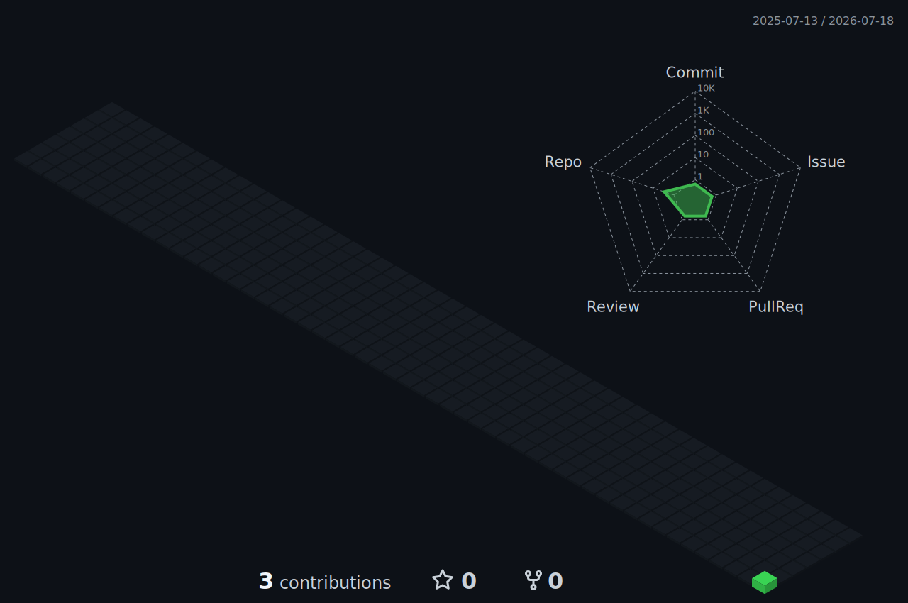

# Hi, I'm onepiecettt 👋

**嵌入式 Linux 系统开发 · Allwinner / Rockchip · ESP32 / Zephyr**

<em>From board bring-up to a reliable embedded system.</em>

 

---

## 关于我

我主要从事嵌入式 Linux 系统开发，关注全志（Allwinner）与瑞芯微（Rockchip）平台上的系统适配、板级调试和工程实践。

我希望从开发板的启动与外设适配出发，逐步深入 Bootloader、Linux 内核、设备树、驱动和根文件系统，建立一套可复现、可调试、可维护的嵌入式开发流程。同时，我也在关注 ESP32 与 Zephyr RTOS，计划持续开展相关项目实践。

## 关注方向

| 方向 | 我在关注什么 |
| --- | --- |
| 🐧 **Embedded Linux** | 系统启动、内核配置、设备树、驱动与根文件系统 |
| 🧱 **Allwinner / Rockchip** | 开发板适配、BSP 分析、外设调试与平台移植 |
| ⚙️ **System Engineering** | 交叉编译、构建流程、问题定位与自动化工具 |
| 📡 **ESP32 / Zephyr** | RTOS、外设控制、网络连接与嵌入式应用开发 |
| 🌱 **Open Source** | 阅读优秀项目，记录实践过程并沉淀可复用经验 |

## 技术路线

- **Linux 启动链路**：理解 BootROM、SPL、U-Boot、Kernel 到 RootFS 的完整启动过程。
- **板级适配与驱动**：围绕设备树、Pin Control、GPIO、I²C、SPI、UART 等常用外设开展实践。
- **系统构建与调试**：整理交叉编译、镜像构建、日志分析和故障定位方法。
- **ESP32 与 Zephyr**：从基础外设和多线程模型入手，逐步探索网络与实际应用项目。

> 这个主页将持续记录开发板实验、问题排查过程和项目总结。目标不是堆砌资料，而是让每个实验都可以复现、验证和继续迭代。

## 计划中的项目

| 项目方向 | 计划内容 |
| --- | --- |
| 🧰 **Board Bring-up Notes** | 记录全志与瑞芯微开发板的启动、烧录、适配和调试过程 |
| 🔌 **Linux Driver Labs** | 整理设备树与常用外设驱动的最小可运行实验 |
| 🏗️ **Embedded Build Tools** | 沉淀镜像构建、环境配置与自动化脚本 |
| 📶 **ESP32 + Zephyr Labs** | 实践 Zephyr 下的外设、线程、通信与网络功能 |

## 我的工程原则

- **可复现**：记录硬件环境、工具链版本、配置和完整操作步骤。
- **小步验证**：拆分启动、驱动和系统问题，逐层定位与验证。
- **保持简单**：优先选择清晰、直接、方便维护的实现方案。
- **持续沉淀**：把一次性的问题排查整理成文档、脚本或最小示例。

## 联系我

欢迎通过 [GitHub Issues](https://github.com/onepiecettt/onepiecettt/issues) 交流 Embedded Linux、开发板适配、ESP32 与 Zephyr。

## GitHub 活动

  
   
  

  Keep learning from the hardware up.

